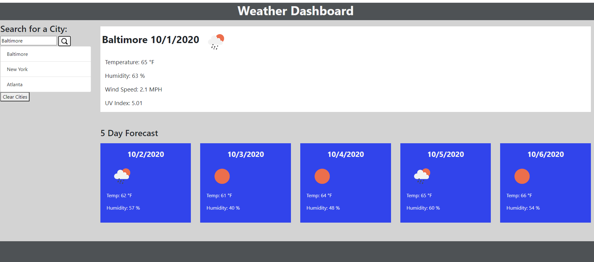

# jhu_homework6

## Purpose
This project required a complete front end build along with api calls to the Open Weather API. It also relied upon the use of local storage. 

## Resources used
Bootstrap and JQuery
Open Weather API

## Future goals
Personally, I am really bad at styling and making something look good. If I had more time, I would try to make the site look better on a smaller device, as well as clean up the general visual appeal. I would also incorporate more of the data we get back from the API call, to better inform the user. 

Another stretch goal would be to allow the user to remove a single city from the saved city list. 

## Link to live site.
https://ddunkle.github.io/jhu_homework6/

## Images of deployed site.

